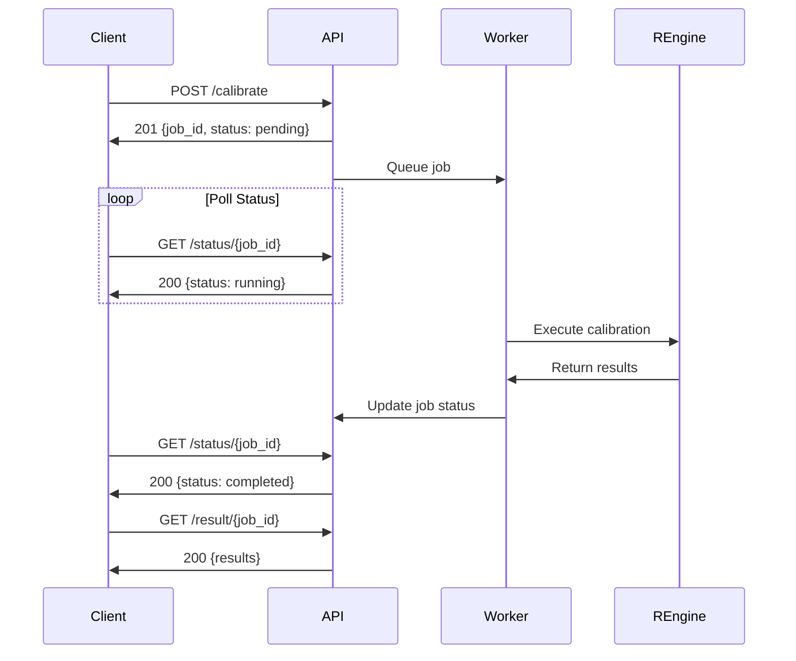

# VA-Calibration API Specification

## API Version: 1.0.0
**Base URL:** `http://localhost:8000`
**Protocol:** HTTP/HTTPS
**Content-Type:** `application/json`

---

## Table of Contents
1. [Overview](#overview)
2. [Authentication](#authentication)
3. [Error Handling](#error-handling)
4. [Data Types](#data-types)
5. [Endpoints](#endpoints)
6. [Workflow](#workflow)
7. [Frontend Implementation Guide](#frontend-implementation-guide)

---

## Overview

The VA-Calibration API provides RESTful endpoints for calibrating computer-coded verbal autopsy (CCVA) algorithms. The API uses asynchronous job processing, meaning calibration requests are submitted and processed in the background while clients can poll for results.

### Key Concepts
- **Job**: A calibration task with unique ID
- **CSMF**: Cause-Specific Mortality Fraction
- **VA Data**: Verbal Autopsy death records
- **Calibration**: Statistical adjustment using CHAMPS gold-standard data

---

## Authentication

Currently, the API does not require authentication. Future versions will support:
- API Key authentication
- OAuth 2.0
- Rate limiting per client

---

## Error Handling

### HTTP Status Codes
| Code | Meaning | Description |
|------|---------|-------------|
| 200 | Success | Request processed successfully |
| 201 | Created | Job created successfully |
| 400 | Bad Request | Invalid input parameters |
| 404 | Not Found | Job ID not found |
| 422 | Unprocessable Entity | Validation error |
| 500 | Internal Server Error | Server-side error |

### Error Response Format
```json
{
  "detail": "Error message",
  "error_message": "Detailed error description",
  "traceback": "Stack trace (development only)"
}
```

---

## Data Types

### Enumerations

#### JobStatus
```typescript
enum JobStatus {
  PENDING = "pending",
  RUNNING = "running",
  COMPLETED = "completed",
  FAILED = "failed"
}
```

#### AgeGroup
```typescript
enum AgeGroup {
  NEONATE = "neonate",  // 0-27 days
  CHILD = "child"        // 1-59 months
}
```

#### VAAlgorithm
```typescript
enum VAAlgorithm {
  EAVA = "eava",
  INSILICOVA = "insilicova",
  INTERVA = "interva"
}
```

#### Country
```typescript
enum Country {
  BANGLADESH = "Bangladesh",
  ETHIOPIA = "Ethiopia",
  KENYA = "Kenya",
  MALI = "Mali",
  MOZAMBIQUE = "Mozambique",
  SIERRA_LEONE = "Sierra Leone",
  SOUTH_AFRICA = "South Africa",
  OTHER = "other"
}
```

#### MmatType
```typescript
enum MmatType {
  FIXED = "Mmatfixed",    // Fixed misclassification matrix
  PRIOR = "Mmatprior"     // With uncertainty quantification
}
```

### Cause Categories

#### Neonate Causes (6 categories)
```typescript
type NeonateCause =
  | "congenital_malformation"
  | "pneumonia"
  | "sepsis_meningitis_inf"  // Sepsis, meningitis, or other infections
  | "ipre"                   // Intrapartum-related events
  | "other"
  | "prematurity";
```

#### Child Causes (9 categories)
```typescript
type ChildCause =
  | "malaria"
  | "pneumonia"
  | "diarrhea"
  | "severe_malnutrition"
  | "hiv"
  | "injury"
  | "other"
  | "other_infections"
  | "nn_causes";  // Neonatal causes
```

---

## Endpoints

### 1. Health Check

#### `GET /`
Check API health status.

**Response:**
```json
{
  "status": "healthy",
  "service": "VA-Calibration API",
  "version": "0.1.0"
}
```

---

### 2. Submit Calibration Job

#### `POST /calibrate`
Submit a new calibration job for processing.

**Request Body:**

```typescript
interface CalibrationRequest {
  va_data: {
    [algorithm: string]: VADataFormat;  // Key is algorithm name
  };
  age_group: AgeGroup;
  country: Country;
  mmat_type?: MmatType;  // Default: "Mmatprior"
  ensemble?: boolean;     // Default: true
  verbose?: boolean;      // Default: false
}
```

**VA Data Formats (VADataFormat):**

**Format 1: Cause List**
```json
{
  "va_data": {
    "insilicova": [
      {"cause": "pneumonia", "id": "death_001"},
      {"cause": "sepsis_meningitis_inf", "id": "death_002"},
      {"cause": "prematurity", "id": "death_003"}
    ]
  }
}
```

**Format 2: Binary Matrix**
```json
{
  "va_data": {
    "insilicova": [
      [0, 0, 1, 0, 0, 0],  // Death 1: sepsis (column 3)
      [0, 1, 0, 0, 0, 0],  // Death 2: pneumonia (column 2)
      [0, 0, 0, 0, 0, 1]   // Death 3: prematurity (column 6)
    ]
  }
}
```
*Note: Column order matches cause categories order*

**Format 3: Death Counts**
```json
{
  "va_data": {
    "insilicova": [0, 10, 39, 30, 5, 16]  // Counts per cause
  }
}
```

**Format 4: Empty (Test Mode)**
```json
{
  "va_data": {
    "insilicova": []  // Uses built-in example data
  }
}
```

**Multiple Algorithms (Ensemble)**
```json
{
  "va_data": {
    "insilicova": [...],
    "interva": [...],
    "eava": [...]
  },
  "ensemble": true
}
```

**Response:**
```json
{
  "job_id": "f6b43ad6-5389-4436-ac81-7b6c27f97afa",
  "status": "pending",
  "message": "Calibration job submitted successfully",
  "created_at": "2025-09-17T17:08:57.607253"
}
```

---

### 3. Check Job Status

#### `GET /status/{job_id}`
Get the current status of a calibration job.

**Path Parameters:**
- `job_id` (string, required): UUID of the job

**Response:**
```json
{
  "job_id": "f6b43ad6-5389-4436-ac81-7b6c27f97afa",
  "status": "completed",
  "created_at": "2025-09-17T17:08:57.607253",
  "completed_at": "2025-09-17T17:09:00.770183",
  "runtime_seconds": 3.162082
}
```

---

### 4. Get Calibration Results

#### `GET /result/{job_id}`
Retrieve complete calibration results.

**Path Parameters:**
- `job_id` (string, required): UUID of the job

**Success Response (status=completed):**
```json
{
  "job_id": "f6b43ad6-5389-4436-ac81-7b6c27f97afa",
  "status": "completed",
  "uncalibrated_csmf": {
    "congenital_malformation": 0.000,
    "pneumonia": 0.100,
    "sepsis_meningitis_inf": 0.390,
    "ipre": 0.300,
    "other": 0.050,
    "prematurity": 0.160
  },
  "calibrated_csmf": {
    "insilicova": {
      "mean": {
        "congenital_malformation": 0.000,
        "pneumonia": 0.055,
        "sepsis_meningitis_inf": 0.594,
        "ipre": 0.257,
        "other": 0.050,
        "prematurity": 0.044
      },
      "lower_ci": {
        "congenital_malformation": 0.000,
        "pneumonia": 0.003,
        "sepsis_meningitis_inf": 0.454,
        "ipre": 0.141,
        "other": 0.050,
        "prematurity": 0.002
      },
      "upper_ci": {
        "congenital_malformation": 0.000,
        "pneumonia": 0.159,
        "sepsis_meningitis_inf": 0.727,
        "ipre": 0.376,
        "other": 0.050,
        "prematurity": 0.124
      }
    }
  },
  "error_message": null,
  "completed_at": "2025-09-17T17:09:00.770183",
  "runtime_seconds": 3.162082
}
```

**Failure Response (status=failed):**
```json
{
  "job_id": "f6b43ad6-5389-4436-ac81-7b6c27f97afa",
  "status": "failed",
  "uncalibrated_csmf": null,
  "calibrated_csmf": null,
  "error_message": "Error: Invalid age group\nType: ValueError\nTraceback: ...",
  "completed_at": "2025-09-17T17:09:00.770183",
  "runtime_seconds": null
}
```

**Ensemble Response (multiple algorithms):**
```json
{
  "calibrated_csmf": {
    "insilicova": {
      "mean": {...},
      "lower_ci": {...},
      "upper_ci": {...}
    },
    "interva": {
      "mean": {...},
      "lower_ci": {...},
      "upper_ci": {...}
    },
    "ensemble": {
      "mean": {...},
      "lower_ci": {...},
      "upper_ci": {...}
    }
  }
}
```

---

### 5. List Jobs

#### `GET /jobs`
List all calibration jobs with optional filtering.

**Query Parameters:**
- `status` (string, optional): Filter by JobStatus
- `limit` (integer, optional): Max results (default: 100, max: 1000)

**Request Example:**
```
GET /jobs?status=completed&limit=10
```

**Response:**
```json
{
  "total": 25,
  "jobs": [
    {
      "job_id": "f6b43ad6-5389-4436-ac81-7b6c27f97afa",
      "status": "completed",
      "created_at": "2025-09-17T17:08:57.607253",
      "completed_at": "2025-09-17T17:09:00.770183"
    },
    {
      "job_id": "92f10855-57c4-49be-a3de-08879a236330",
      "status": "failed",
      "created_at": "2025-09-17T17:05:44.137848",
      "completed_at": "2025-09-17T17:05:44.213789"
    }
  ]
}
```

---

### 6. Delete Job

#### `DELETE /jobs/{job_id}`
Delete a job record and its results.

**Path Parameters:**
- `job_id` (string, required): UUID of the job

**Response:**
```json
{
  "message": "Job f6b43ad6-5389-4436-ac81-7b6c27f97afa deleted successfully"
}
```

---

## Workflow

### Standard Calibration Workflow



---

## Frontend Implementation Guide

### 1. TypeScript Interface Definitions

```typescript
// types/calibration.ts

interface CalibrationRequest {
  va_data: Record<string, VAData>;
  age_group: 'neonate' | 'child';
  country: string;
  mmat_type?: 'Mmatfixed' | 'Mmatprior';
  ensemble?: boolean;
  verbose?: boolean;
}

type VAData = CauseList | BinaryMatrix | DeathCounts | EmptyArray;

interface CauseItem {
  cause: string;
  id: string | number;
}

type CauseList = CauseItem[];
type BinaryMatrix = number[][];
type DeathCounts = number[];
type EmptyArray = [];

interface JobResponse {
  job_id: string;
  status: JobStatus;
  message: string;
  created_at: string;
}

interface JobStatus {
  job_id: string;
  status: 'pending' | 'running' | 'completed' | 'failed';
  created_at: string;
  completed_at?: string;
  runtime_seconds?: number;
}

interface CalibrationResult {
  job_id: string;
  status: string;
  uncalibrated_csmf: Record<string, number>;
  calibrated_csmf: {
    [algorithm: string]: {
      mean: Record<string, number>;
      lower_ci: Record<string, number>;
      upper_ci: Record<string, number>;
    };
  };
  error_message?: string;
  completed_at?: string;
  runtime_seconds?: number;
}
```

### 2. React Hook Example

```typescript
// hooks/useCalibration.ts

import { useState, useEffect } from 'react';

export const useCalibration = () => {
  const [job, setJob] = useState<JobResponse | null>(null);
  const [status, setStatus] = useState<JobStatus | null>(null);
  const [result, setResult] = useState<CalibrationResult | null>(null);
  const [loading, setLoading] = useState(false);
  const [error, setError] = useState<string | null>(null);

  const API_BASE = process.env.REACT_APP_API_URL || 'http://localhost:8000';

  const submitCalibration = async (request: CalibrationRequest) => {
    setLoading(true);
    setError(null);

    try {
      const response = await fetch(`${API_BASE}/calibrate`, {
        method: 'POST',
        headers: { 'Content-Type': 'application/json' },
        body: JSON.stringify(request)
      });

      if (!response.ok) throw new Error(`HTTP ${response.status}`);

      const jobData = await response.json();
      setJob(jobData);

      // Start polling for status
      pollStatus(jobData.job_id);

    } catch (err) {
      setError(err.message);
      setLoading(false);
    }
  };

  const pollStatus = async (jobId: string) => {
    const interval = setInterval(async () => {
      try {
        const response = await fetch(`${API_BASE}/status/${jobId}`);
        const statusData = await response.json();
        setStatus(statusData);

        if (statusData.status === 'completed' || statusData.status === 'failed') {
          clearInterval(interval);
          await fetchResult(jobId);
          setLoading(false);
        }
      } catch (err) {
        clearInterval(interval);
        setError(err.message);
        setLoading(false);
      }
    }, 2000); // Poll every 2 seconds
  };

  const fetchResult = async (jobId: string) => {
    try {
      const response = await fetch(`${API_BASE}/result/${jobId}`);
      const resultData = await response.json();
      setResult(resultData);
    } catch (err) {
      setError(err.message);
    }
  };

  return {
    submitCalibration,
    job,
    status,
    result,
    loading,
    error
  };
};
```

### 3. Component Example

```tsx
// components/CalibrationForm.tsx

import React, { useState } from 'react';
import { useCalibration } from '../hooks/useCalibration';

export const CalibrationForm: React.FC = () => {
  const { submitCalibration, result, loading, error } = useCalibration();
  const [formData, setFormData] = useState({
    algorithm: 'insilicova',
    ageGroup: 'neonate',
    country: 'Mozambique',
    mmatType: 'Mmatfixed',
    vaData: ''
  });

  const handleSubmit = (e: React.FormEvent) => {
    e.preventDefault();

    // Parse VA data (could be JSON or CSV)
    let vaData;
    try {
      vaData = JSON.parse(formData.vaData || '[]');
    } catch {
      vaData = []; // Use example data
    }

    submitCalibration({
      va_data: { [formData.algorithm]: vaData },
      age_group: formData.ageGroup as 'neonate' | 'child',
      country: formData.country,
      mmat_type: formData.mmatType as 'Mmatfixed' | 'Mmatprior'
    });
  };

  return (
    <div>
      <form onSubmit={handleSubmit}>
        {/* Form fields */}
        <button type="submit" disabled={loading}>
          {loading ? 'Processing...' : 'Submit Calibration'}
        </button>
      </form>

      {error && <div className="error">{error}</div>}

      {result && result.status === 'completed' && (
        <div className="results">
          <h3>Calibration Results</h3>
          <CalibrationChart data={result.calibrated_csmf} />
        </div>
      )}
    </div>
  );
};
```

### 4. Visualization Component

```tsx
// components/CalibrationChart.tsx

import React from 'react';
import { BarChart, Bar, XAxis, YAxis, CartesianGrid, Tooltip, Legend } from 'recharts';

interface Props {
  data: CalibrationResult['calibrated_csmf'];
}

export const CalibrationChart: React.FC<Props> = ({ data }) => {
  // Transform data for chart
  const chartData = Object.entries(data.insilicova.mean).map(([cause, value]) => ({
    cause: cause.replace(/_/g, ' '),
    uncalibrated: 0, // Would come from uncalibrated_csmf
    calibrated: value * 100,
    lowerCI: data.insilicova.lower_ci[cause] * 100,
    upperCI: data.insilicova.upper_ci[cause] * 100
  }));

  return (
    <BarChart width={800} height={400} data={chartData}>
      <CartesianGrid strokeDasharray="3 3" />
      <XAxis dataKey="cause" angle={-45} textAnchor="end" />
      <YAxis label={{ value: 'Percentage (%)', angle: -90 }} />
      <Tooltip />
      <Legend />
      <Bar dataKey="calibrated" fill="#8884d8" />
      <Bar dataKey="lowerCI" fill="#82ca9d" />
      <Bar dataKey="upperCI" fill="#ffc658" />
    </BarChart>
  );
};
```

### 5. Data Validation Utilities

```typescript
// utils/validation.ts

export const validateCauseList = (data: any[]): boolean => {
  return data.every(item =>
    typeof item === 'object' &&
    'cause' in item &&
    'id' in item
  );
};

export const validateBinaryMatrix = (data: any[][], causes: number): boolean => {
  return data.every(row =>
    Array.isArray(row) &&
    row.length === causes &&
    row.every(val => val === 0 || val === 1) &&
    row.reduce((sum, val) => sum + val, 0) === 1
  );
};

export const validateDeathCounts = (data: any[], causes: number): boolean => {
  return Array.isArray(data) &&
         data.length === causes &&
         data.every(val => typeof val === 'number' && val >= 0);
};

export const getCauseCount = (ageGroup: string): number => {
  return ageGroup === 'neonate' ? 6 : 9;
};

export const getCauseNames = (ageGroup: string): string[] => {
  if (ageGroup === 'neonate') {
    return [
      'congenital_malformation',
      'pneumonia',
      'sepsis_meningitis_inf',
      'ipre',
      'other',
      'prematurity'
    ];
  } else {
    return [
      'malaria',
      'pneumonia',
      'diarrhea',
      'severe_malnutrition',
      'hiv',
      'injury',
      'other',
      'other_infections',
      'nn_causes'
    ];
  }
};
```

---

## Notes for Frontend Developers

### Best Practices

1. **Error Handling**: Always check job status before fetching results
2. **Polling**: Use exponential backoff for long-running jobs (start at 2s, max 30s)
3. **Timeout**: Set a maximum timeout (e.g., 5 minutes) for calibration jobs
4. **Caching**: Cache results by job_id to avoid redundant API calls
5. **Validation**: Validate input data format before submission
6. **Loading States**: Show progress indicators during processing
7. **Retry Logic**: Implement retry with exponential backoff for network errors

### Common Issues

1. **Empty VA Data**: API accepts empty arrays and uses example data
2. **Cause Mapping**: Some causes have alternative names (e.g., "sepsis" → "sepsis_meningitis_inf")
3. **Matrix Column Order**: Must match the cause category order exactly
4. **Ensemble Mode**: Requires identical death counts across algorithms

### Performance Considerations

- Small datasets (< 100 deaths): ~3-5 seconds
- Medium datasets (100-1000 deaths): ~5-15 seconds
- Large datasets (> 1000 deaths): ~15-60 seconds
- Ensemble mode adds ~20% to processing time

### Testing

Use empty VA data for quick testing:
```json
{
  "va_data": {"insilicova": []},
  "age_group": "neonate",
  "country": "Mozambique"
}
```

This will use built-in example data and return results in ~3 seconds.

---

## Changelog

### Version 1.0.0 (2025-09-17)
- Initial API release
- Support for three VA algorithms
- Four input data formats
- Asynchronous job processing
- Ensemble calibration support